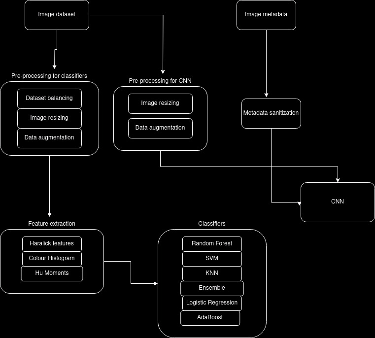

# Skin Cancer Recognition

This project aims to develop a deep learning model to recognize skin cancer from images of skin lesions. Using the HAM10000 dataset, which consists of 10,000 dermatoscopic images of skin lesions, we train a Convolutional Neural Network (CNN) and several classifiers to classify different types of skin lesions and potentially identify skin cancer.
Table of Contents

    Introduction
    Dataset
    Model Architecture
    Installation
    Usage
    Results
    Contributing
    License

## Introduction

Skin cancer is one of the most common forms of cancer, and early detection is crucial for effective treatment. The goal of this project is to leverage machine learning, specifically a Convolutional Neural Network (CNN), to aid in the early detection and classification of skin cancer from images of skin lesions.
Dataset

The HAM10000 ("Human Against Machine with 10000 training images") dataset is used in this project. It contains 10,000 dermatoscopic images of skin lesions, which are categorized into the following classes:

    Melanocytic nevi
    Melanoma
    Benign keratosis-like lesions
    Basal cell carcinoma
    Actinic keratoses
    Vascular lesions
    Dermatofibroma

## Downloading the Dataset

You can download the HAM10000 dataset from [Kaggle](https://www.kaggle.com/datasets/kmader/skin-cancer-mnist-ham10000).

## Project Architecture

In our projects we have used two strategies to classify the lesions, one being feature extraction and then using various classsifers and the other on is creating and training a Convolutional Neural Network (CNN) based on the images and their metadata.
Here is a high level diagram of our project:



## Image preprocessing and data augmetation for the CNN

For our CNN we have resized all the images to 28x28, and augmented them by flipping, rotating and zooming. We have also sanitized the metadata and applied means to all null values.

## CNN architecture

| Layer (type)                    | Output Shape       | Param #   | Connected to           |
| ------------------------------- | ------------------ | --------- | ---------------------- |
| keras_tensor_351CL (InputLayer) | (None, 28, 28, 3)  | 0         | -                      |
| conv2d_24 (Conv2D)              | (None, 28, 28, 32) | 896       | keras_tensor_351CL     |
| batch_normalization_19          | (None, 28, 28, 32) | 128       | conv2d_24              |
| re_lu_40 (ReLU)                 | (None, 28, 28, 32) | 0         | batch_normalization_19 |
| conv2d_25 (Conv2D)              | (None, 28, 28, 32) | 9,248     | re_lu_40               |
| batch_normalization_20          | (None, 28, 28, 32) | 128       | conv2d_25              |
| re_lu_41 (ReLU)                 | (None, 28, 28, 32) | 0         | batch_normalization_20 |
| conv2d_26 (Conv2D)              | (None, 28, 28, 32) | 9,248     | re_lu_41               |
| batch_normalization_21          | (None, 28, 28, 32) | 128       | conv2d_26              |
| re_lu_42 (ReLU)                 | (None, 28, 28, 32) | 0         | batch_normalization_21 |
| max_pooling2d_11 (MaxPooling2D) | (None, 14, 14, 32) | 0         | re_lu_42               |
| conv2d_27 (Conv2D)              | (None, 14, 14, 64) | 18,496    | max_pooling2d_11       |
| batch_normalization_22          | (None, 14, 14, 64) | 256       | conv2d_27              |
| re_lu_43 (ReLU)                 | (None, 14, 14, 64) | 0         | batch_normalization_22 |
| conv2d_28 (Conv2D)              | (None, 14, 14, 64) | 36,928    | re_lu_43               |
| batch_normalization_23          | (None, 14, 14, 64) | 256       | conv2d_28              |
| keras_tensor_350CL (InputLayer) | (None, 23)         | 0         | -                      |
| re_lu_44 (ReLU)                 | (None, 14, 14, 64) | 0         | batch_normalization_23 |
| dense_21 (Dense)                | (None, 128)        | 3,072     | keras_tensor_350CL     |
| conv2d_29 (Conv2D)              | (None, 14, 14, 64) | 36,928    | re_lu_44               |
| batch_normalization_24          | (None, 128)        | 512       | dense_21               |
| batch_normalization_25          | (None, 14, 14, 64) | 256       | conv2d_29              |
| re_lu_46 (ReLU)                 | (None, 128)        | 0         | batch_normalization_24 |
| re_lu_45 (ReLU)                 | (None, 14, 14, 64) | 0         | batch_normalization_25 |
| dense_22 (Dense)                | (None, 128)        | 16,512    | re_lu_46               |
| max_pooling2d_12 (MaxPooling2D) | (None, 7, 7, 64)   | 0         | re_lu_45               |
| batch_normalization_26          | (None, 128)        | 512       | dense_22               |
| flatten_5 (Flatten)             | (None, 3136)       | 0         | max_pooling2d_12       |
| re_lu_47 (ReLU)                 | (None, 128)        | 0         | batch_normalization_26 |
| concatenate_5 (Concatenate)     | (None, 3264)       | 0         | flatten_5, re_lu_47    |
| dense_23 (Dense)                | (None, 1024)       | 3,343,360 | concatenate_5          |
| batch_normalization_27          | (None, 1024)       | 4,096     | dense_23               |
| re_lu_48 (ReLU)                 | (None, 1024)       | 0         | batch_normalization_27 |
| dense_24 (Dense)                | (None, 7)          | 7,175     | re_lu_48               |

## Classifiers

Parallel to the implementation of our CNN, we have decided it is a good idea to train some classifiers on the same dataset. We will use the following classifiers:

- Logistic Regression
- Random Forest
- SVM
- KNN
- AdaBoost
- Ensemble of the above classifiers

The classifiers where trained on features extracted from the images, a method from this [paper](https://www.nature.com/articles/s41598-022-22644-9).

## Image preprocessing and augmentation for feature extraction

For feature extraction we have decided to balance the dataset by choosing a 100 images from each class, we then have augmented them by zooming, flipping and rotating.

## Installation

To run this project, you need to have Python installed along with several libraries. You can install the required libraries using the following command:

```

pip install -r requirements.txt

```

### Usage

Clone the repository:

`git clone https://github.com/dawba/skin-cancer-recognition`
`cd skin-cancer-recognition`

#### Download and prepare the dataset:

Download the dataset from [Kaggle](https://www.kaggle.com/datasets/kmader/skin-cancer-mnist-ham10000)

#### Place the dataset in the 'data' directory

`mkdir data`
`mv path_to_downloaded_dataset data/`

#### Open the notebooks

Now you can open and run any of the included notebooks using your prefered Jupyter reader.

## Results

After training all our classifiers and the CNN we have ended up with the CNN having a 0.81 accuracy score and the best classifier (Random Forest) having a 0.871 accuracy score. All other commonly used metrics can be found in the assorted notebooks.
